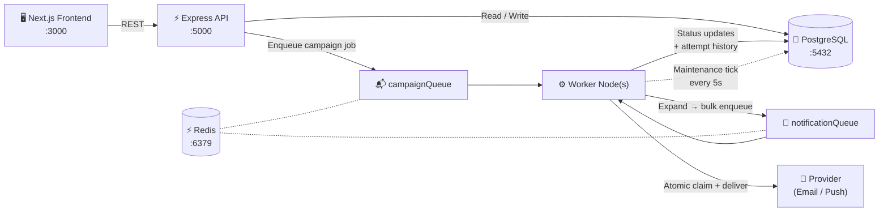
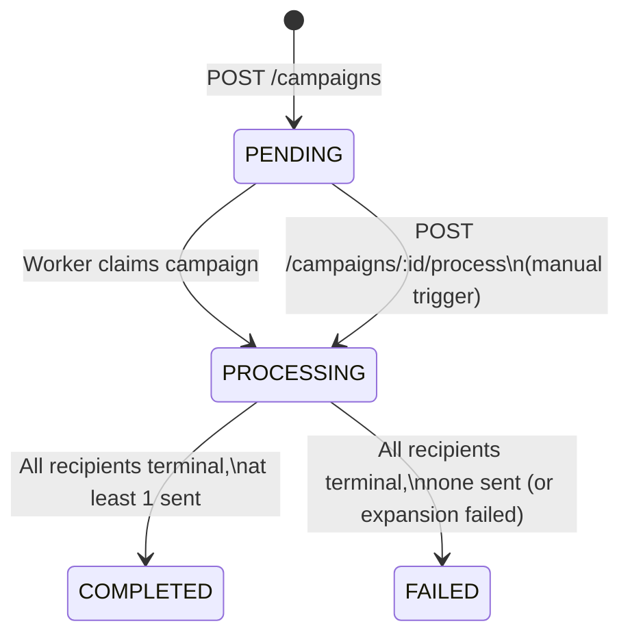
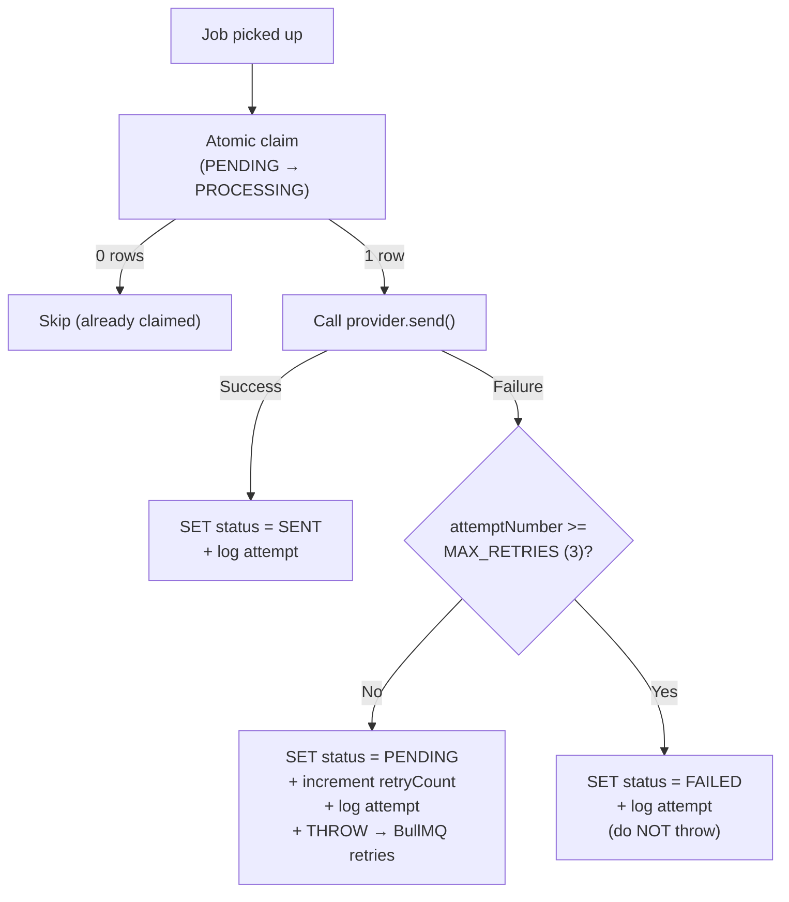

# Architecture 🏗️

> A deep-dive into the design decisions, data flow, and guarantees of the Notification Delivery System.

---

## System Overview



**One sentence:** The API accepts a campaign request, persists it to PostgreSQL, and enqueues a single job. The worker expands that job into 100K+ individual notification jobs, delivers each one through a provider, and writes every status transition back to the database — all with retry, idempotency, and crash recovery baked in.

---

## 1. Containerized Infrastructure

The system is composed of five Docker containers orchestrated by Docker Compose:

| Container | Role | Port |
| --- | --- | --- |
| **postgres** | Source of truth — users, campaigns, notifications, attempts | `5432` |
| **redis** | Ephemeral message broker for BullMQ job queues | `6379` |
| **backend** | Express REST API — validates, persists, enqueues | `5000` |
| **worker** | Standalone Node.js process — drains queues, delivers notifications | — |
| **frontend** | Next.js dashboard — campaign creation, real-time progress | `3000` |

**Key design choices:**
- **Health-gated startup:** The backend waits for Postgres and Redis health checks before booting. The worker waits for the backend.
- **Auto-bootstrapping:** The backend container runs `npm run migrate → npm run seed → npm run dev` on every start. Seeding is idempotent (`ON CONFLICT DO NOTHING`).
- **Horizontal scaling:** Workers can be scaled independently (`docker-compose up --scale worker=3`) with zero code changes — concurrency protection (§7) ensures correctness.

---

## 2. Why PostgreSQL?

Notifications are **relational** and **correctness-critical**:

| Requirement | PostgreSQL Feature |
| --- | --- |
| No duplicate notifications | `UNIQUE(campaignId, userId, channel)` + `ON CONFLICT DO NOTHING` |
| Atomic status transitions | `UPDATE … WHERE status = 'PENDING' RETURNING *` |
| Transactional attempt history | `$transaction([update, create])` |
| Aggregated progress counts | `GROUP BY status` over `(campaignId, status)` index |
| 50M-row query performance | Composite indexes, keyset pagination, future partitioning |

PostgreSQL is the **single source of truth**. Redis is disposable — flush it and the system self-heals.

---

## 3. Why Redis + BullMQ?

Delivery **must not** run inside the HTTP request path. BullMQ provides:

- **Durable queues** with Redis persistence
- **Delayed jobs** for `scheduledAt` scheduling
- **Per-job retry** with configurable exponential backoff
- **Bounded concurrency** (`NOTIFICATION_WORKER_CONCURRENCY = 20`)
- **Stalled-job detection** built in

**Two queues, clear separation of concerns:**

| Queue | Job | Purpose |
| --- | --- | --- |
| `campaignQueue` | `expand` | Expand one campaign into batches of notification jobs |
| `campaignQueue` | `reconcile` | Recurring maintenance — progress sync + stuck job recovery |
| `notificationQueue` | `send` | Deliver a single notification through the provider |

---

## 4. Why a Separate Worker Process?

The `worker` container is its own isolated Node.js process (no `worker_threads`):

- A **crash**, **memory leak**, or **slow batch** in the worker cluster never affects API latency.
- Deploying or restarting the API **does not interrupt** active delivery.
- Workers scale independently — more processes = more throughput, all safe via the atomic claim (§7).
- Graceful shutdown (`SIGINT` / `SIGTERM`) closes both BullMQ workers, the queue, and the database connection cleanly.

---

## 5. 100K Batching Strategy

### Data Flow

```text
POST /campaigns
  → INSERT campaign + campaign_recipients (using Prisma createMany)
  → Enqueue 1 job to campaignQueue
  → Return 202 Accepted

Worker picks up the campaign job:
  loop {
    SELECT userId FROM campaign_recipients
      WHERE campaignId = ? AND userId > :cursor
      ORDER BY userId LIMIT 1000              ← keyset scan

    prisma.notification.createMany({ ... })
      skipDuplicates: true                  ← idempotent

    addBulk(notificationQueue, all PENDING notifications in this batch)

    cursor = last userId
  }
```

### Why this works at scale

- **Keyset scan** over the `UNIQUE(campaignId, userId)` index → constant cost per batch, no `OFFSET`, no extra index.
- **O(batch) memory** — only integer user IDs of one batch live in Node at a time.
- **Prisma `createMany` with `skipDuplicates`** — notifications are created in bulk per batch, never row-by-row. Prisma translates this to a single `INSERT ... ON CONFLICT DO NOTHING`.
- **Crash-safe re-run** — `skipDuplicates: true` on inserts + deterministic BullMQ job IDs make the entire expansion idempotent.

### Progress Tracking

Progress is **never** a per-notification counter update (which would hammer the campaign row with row-level locks):

- `GET /campaigns/:id/progress` runs one `GROUP BY status` query over the `(campaignId, status)` index — live and instant.
- The maintenance job (every `RECONCILE_INTERVAL_SECONDS` = 5s) writes `completedCount` / `failedCount` and the final status to the campaign row in **one UPDATE per active campaign per tick**.

---

## 6. Campaign Lifecycle



| Status | Meaning |
| --- | --- |
| `PENDING` | Created and queued (possibly scheduled for the future). Expansion has not started. |
| `PROCESSING` | A worker has claimed it. Notifications are being created and delivered. |
| `COMPLETED` | Every recipient's notification is terminal (`SENT` / `FAILED`) and **at least one was sent**. |
| `FAILED` | Every recipient is terminal and **none were sent**, or expansion itself failed after 3 attempts. |

Individual failures inside a `COMPLETED` campaign are visible through `failedCount` and the notification list.

---

## 7. Concurrency Protection & Atomic Claim

Before sending, a worker **atomically claims** the notification row:

```typescript
// Prisma updateMany — atomic compare-and-swap
const result = await prisma.notification.updateMany({
  where: { id: notificationId, status: 'PENDING' },
  data: { status: 'PROCESSING', processingStartedAt: new Date() },
});
if (result.count === 0) return 'skipped'; // already claimed
```

- Only the worker whose `updateMany` returns `count = 1` delivers the notification. All others get `count = 0` and **skip** immediately.
- PostgreSQL serialises the `UPDATE WHERE status = 'PENDING'` under the hood, ensuring exactly one worker wins per notification.

---

## 8. Retry Strategy & Fault Tolerance



**Key details:**
- **Budget:** `MAX_NOTIFICATION_RETRIES` = 3 attempts total.
- **Backoff:** Exponential — notification jobs start at a `1s` base delay; campaign expand jobs start at `5s`. Both double on each retry (configured in `queue/index.ts`).
- **Transactional logging:** Every failure atomically updates the notification row **and** appends a `notification_attempts` record in one `$transaction`.
- **Last attempt:** Sets `FAILED` and does **not** rethrow, so BullMQ stops retrying.
- **Crash resilience:** The retry budget is derived from `retryCount` in the database, not BullMQ's in-memory counter — it survives worker restarts and re-queues.
- **At-least-once delivery:** If a worker dies after the provider accepted a message but before the `SENT` update, the stuck-job recovery re-sends it. Real providers should use `notification.id` as an idempotency key.

### Stuck Job Recovery

The maintenance job (every 5s) resets notifications stuck in `PROCESSING` for longer than `PROCESSING_TIMEOUT_SECONDS` (300s) back to `PENDING` and re-enqueues them — bounded to 1,000 rows per tick.

---

## 9. Idempotency Guarantees

| Layer | Mechanism | Effect |
| --- | --- | --- |
| **Recipients** | `UNIQUE(campaignId, userId)` | A duplicate expansion cannot create a second recipient |
| **Notifications** | `UNIQUE(campaignId, userId, channel)` | `ON CONFLICT DO NOTHING` — no duplicate notifications |
| **BullMQ jobs** | Deterministic job IDs (`campaign-<id>`, `notification-<id>`) | Double enqueues are silently ignored |
| **Campaign trigger** | `POST /campaigns/:id/process` claims with `UPDATE … WHERE status IN ('PENDING', 'PROCESSING')` | Calling it repeatedly is safe |
| **Full recovery** | Redis can be flushed entirely | Call `/process` again → expansion re-enqueues all still-`PENDING` notifications |

---

## 10. 50M-Row Query Strategy

The user notifications endpoint serves a **per-user, newest-first** list:

```sql
SELECT … FROM notifications n
  JOIN users u … JOIN campaigns c …
WHERE n."isVisible" AND n."userId" = 123
  AND (n."createdAt", n.id) < ($ts, $id)   -- cursor
ORDER BY n."createdAt" DESC, n.id DESC
LIMIT 21;
```

| Technique | Why |
| --- | --- |
| **Covering index** `(userId, createdAt DESC, id DESC)` | Index range scan stops after 21 rows. No sort node. Cost is independent of table size. |
| **Keyset (cursor) pagination** | Cursor = `(createdAt, id)`. `id` breaks ties. No `OFFSET` — every page is equally fast. |
| **Limited page size** | Default 20, max 100. Only the columns the UI needs are projected. |
| **Future partitioning** | Range-partition `notifications` by `createdAt` (monthly). Drop old partitions instead of `DELETE`. |

---

## 11. Known Trade-offs

| Decision | Trade-off |
| --- | --- |
| **One BullMQ job per notification** | Native per-notification retry/backoff and easy concurrency limits, at the cost of Redis memory (peak ~51 MB at 100K jobs). Batch jobs would be lighter but need custom retry bookkeeping. |
| **Recipients persisted inside the request** | We currently load user IDs into memory and use Prisma's `createMany`. This is fast enough for 100K, but unbounded. For >1M recipients, this must be refactored to use a raw `INSERT ... SELECT` to avoid Node.js memory limits. |
| **Progress lag** | Campaign row lags by up to `RECONCILE_INTERVAL_SECONDS` (5s). Chosen over a per-notification counter update which would lock the row aggressively. The `/progress` endpoint itself queries live counts. |
| **At-least-once delivery** | Not exactly-once — no queue can guarantee that against an external provider without distributed transactions. |
| **No authentication** | Out of scope for this system. Would be added as Express middleware in production. |
